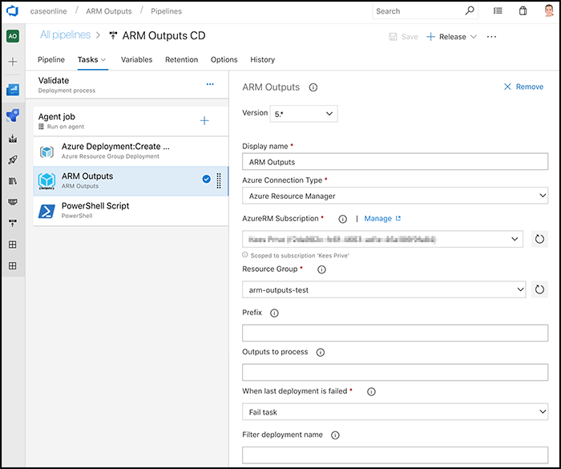
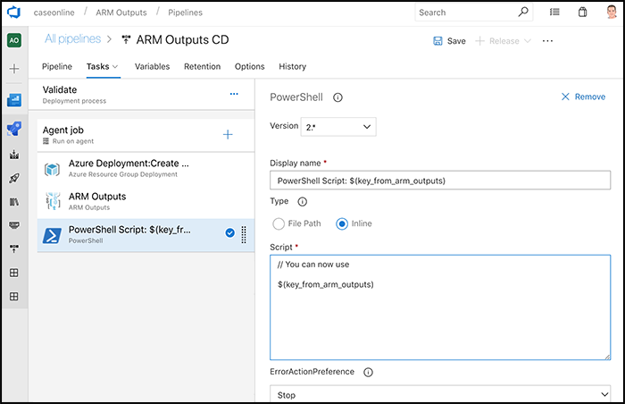

<h1 align="center">

</h1>

This extension enables you to use the ARM Deployment outputs in your Azure Pipelines.

This step will use the last successful deployment within the selected resource group. If this deployent has outputs, all of them are copied to Pipeline variables by the ARM Output key: 

[](images/screenshot.png)

This outputs can then be used by default VSTS ways: ```$(same-key-as-in-arm-template)```

Usually this task is ran directly after the 'Azure Resource Group Deployment' task.

[](images/screenshot2.png)

## Release notes

### Version 5.0 - 25-12-2018

- Rewrite to Node to enable Linux based agents
- Updated naming (VSTS > Azure DevOps)

Previous release info can be found on [GitHub Releases](https://github.com/keesschollaart81/vsts-arm-outputs/releases) 

## Parameter usage

### Prefix

Using the 'prefix' parameter, it is possible to prefix the variables used within Pipelines. A prefix can be used to distinct variables coming out of ARM from regular Pipeline variables. A prefix can also be to prevent collisions between ARM Output names and Pipeline Variable names.

### Output Names

Using the 'Output Names' parameter, it is possible to process only a subset of the ARM Outputs. When this field is left empty (it is by default) all ARM Outputs are used.

### When last deployment is failed

Using the 'When last deployment is failed' parameter, you can choose the behaviour when the last deployment to a resource group has failed. There are two options, 1. fail the task (the default) or 2. take the last succesful deployment. 

### Filter deployment name

Optional string to filter deployments by. This can be useful if you have concurrent deployments to the same resource group. Deployment names in Pipelines are the name of the json file plus date and time, so a file CreateKeyVault.json could have a deployment name of CreateKeyVault-20180025-151538-0688. In this case, if you want to filter to deployments of this file enter CreateKeyVault as the filter

## Good to know

### Secrets

If your output is of type ```SecureString``` the output value cannot be read and these outputs are therefore ignored.

You can off course output your secrets as string but then these values might be exposed in logfiles (and visible via the Azure Portal as well)

### Complex outputs

If your output is not a single value but a complex type, like:
``` json
{
    "parameters": {},
    "resources": {},
    "outputs": {
        "someKey":"someValue",
        "second": {
            "foo":"bar",
            "oops": {
                "asdasdasd":true,
                "array": [
                    {
                        "asd":"qqq"
                    },
                    {
                        "efg":"aaa"
                    }
                ]
            }
        }
    }
}
````
This will result in the following 5 variables:

```
complex_someKey => someValue
complex_second_foo => bar
complex_second_oops_asdasdasd => True
complex_second_oops_array_0_asd => qqq
complex_second_oops_array_1_efg => aaa
```

## Help & Contact

Find me at http://case.schollaart.net/. Experiencing problems, or do you have an idea? Please let me know via [Twitter](https://twitter.com/keesschollaart) or by [mail](mailto:keesschollaart81@hotmail.com). Or even better, raise an issue on [GitHub](https://github.com/keesschollaart81/vsts-arm-outputs/issues).