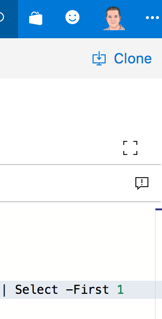

# ARM Outputs

This extension enables you to use the ARM Deployment outputs in your VSTS environment.

This step will use the last successful deployment within the selected resource group. If this deployent has outputs, all of them are copied to VSTS variables by the ARM Output key.

This outputs can then be used by default VSTS ways: ```$(same-key-as-in-arm-template)```

Usually this task is ran directly after the 'Azure Resource Group Deployment' task.

[](images/screenshots-vsts-arm-outputs-1.png)

## Secrets

If your output is of type ```SecureString``` we cannot read the output value and these outputs are therefore ignored.

You can off course output your secrets as string but then these values might be exposed in logfiles (and visible via the Azure Portal as well)

## Prefix

Using the 'prefix' parameter, it is possible to prefix the variables used within VSTS. A prefix can be used to distinct variables coming out of ARM from regular VSTS variables. A prefix can also be to prevent collisions between ARM Output names and VSTS Variable names.

## Output Names

Using the 'Output Names' parameter, it is possible to process only a subset of the ARM Outputs. When this field is left empty (it is by default) all ARM Outputs are used.